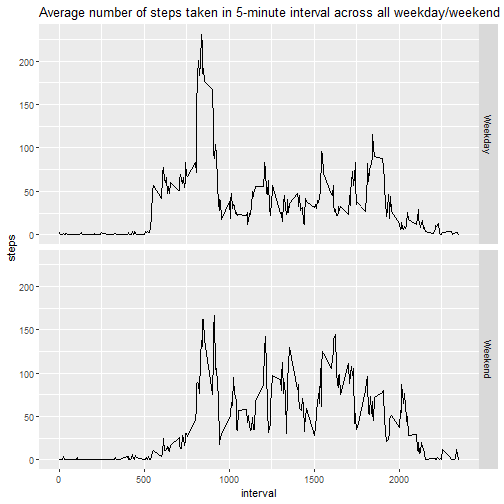

## Setting Global Option


```r
knitr::opts_chunk$set(echo = TRUE)
```

## Loading and processing data


```r
unzip("activity.zip")
activity <- read.csv("activity.csv")
activity$date <- as.Date(activity$date, "%Y-%m-%d")
```

## What is mean total number of steps taken per day?  

**Making a histogram of the total number of steps taken each day**


```r
library(dplyr)
library(ggplot2)

act_bydate <- group_by(activity, date)
stepsperday <- summarize(act_bydate, steps=sum(steps, na.rm=TRUE))

g <- ggplot(stepsperday, aes(date, steps))
g+geom_col(color="black", fill="blue")+labs(title="Total Steps Taken Each Day")
```


```r
stepsmean <- as.integer(mean(stepsperday$steps))
stepsmedian <- as.integer(median(stepsperday$steps))
```

**Mean of the total number of steps taken per day is: 9354**  
**Median of the total number of steps taken per day is: 10395**

## What is the average daily activity pattern?  

**Making a time series plot of the 5-minute interval (x-axis) and the average number of steps taken, averaged across all days (y-axis)**  

```r
act_byinterval <- group_by(activity, interval)
steps_interval<- summarize(act_byinterval, steps=mean(steps, na.rm=TRUE))
with(steps_interval, plot(interval, steps, type="l"))
mtext("Average number of steps taken in each 5-minute interval")
```


**Calculating which 5-minute interval contains the maximum average number of steps across all the days in the dataset**  


```r
max_steps <- as.integer(max(steps_interval$steps))
max_interval <- steps_interval[steps_interval$steps>=max_steps, 1]
```

**On average across all the days in the dataset, interval 835 contains the maximum number of steps of 206**  

## Imputing missing values  


```r
stepsNA <- is.na(activity$steps)
totalNA <- sum(stepsNA)
```

**Total number of missing values in the dataset is 2304**   


```r
## imput NA using mean of steps in the 5-minute interval across all days

activity_meansteps <- mutate(act_byinterval, steps = mean(steps,na.rm=TRUE))
activity_clean <- coalesce(activity, activity_meansteps)
```

**Making another histogram of the total number of steps taken each day using cleaned data with no NA values**  


```r
## using clean data to plot the historgram
act_bydate <- group_by(activity_clean, date)
stepsperday <- summarize(act_bydate, steps=sum(steps, na.rm=TRUE))

g <- ggplot(stepsperday, aes(date, steps))
g+geom_col(color="black", fill="blue")+labs(title="Total Steps Taken Each Day")
```


```r
stepsmean <- as.integer(mean(stepsperday$steps))
stepsmedian <- as.integer(median(stepsperday$steps))
```

**Mean of the total number of steps taken per day is: 10766**  
**Median of the total number of steps taken per day is: 10766**

**Do these values differ from the estimates from the first part of the assignment?**  
*Yes.*

**What is the impact of imputing missing data on the estimates of the total daily number of steps?**  
*With imputing missing data, some days that have estimated 0 steps previously now have values.  As a result, the mean and median of the total number of steps taken per day are more than before and the mean also equals to the median.*  

## Are there differences in activity patterns between weekdays and weekends?

**Adding a new factor variable in the dataset with two levels – “weekday” and “weekend” indicating whether a given date is a weekday or weekend day.**


```r
activity_clean$daytype <- weekdays(activity_clean$date, abbreviate = TRUE)

activity_clean$daytype <- sub("Mon", "Weekday", activity_clean$daytype)
activity_clean$daytype <- sub("Tue", "Weekday", activity_clean$daytype)
activity_clean$daytype <- sub("Wed", "Weekday", activity_clean$daytype)
activity_clean$daytype <- sub("Thu", "Weekday", activity_clean$daytype)
activity_clean$daytype <- sub("Fri", "Weekday", activity_clean$daytype)
activity_clean$daytype <- sub("Sat", "Weekend", activity_clean$daytype)
activity_clean$daytype <- sub("Sun", "Weekend", activity_clean$daytype)
activity_clean$daytype <- as.factor(activity_clean$daytype)
```

**Making a panel plot containing a time series plot of the 5-minute interval (x-axis) and the average number of steps taken, averaged across all weekday days or weekend days (y-axis)**


```r
activity_clean <- group_by(activity_clean, daytype, .add=FALSE)
activity_clean <- group_by(activity_clean, interval, .add=TRUE)
steps_interval<- summarize(activity_clean, steps=mean(steps, na.rm=TRUE))
```

```
## `summarise()` has grouped output by 'daytype'. You can override using the `.groups` argument.
```

```r
g <- ggplot(steps_interval, aes(interval, steps))
g+geom_line()+facet_grid(rows=vars(daytype))+labs(title="Average number of steps taken in 5-minute interval across all weekday/weekend")
```


  
**NOTE: The average number of steps taken during weekend seem to be more even than weekday where there seems to spike in late morning**
